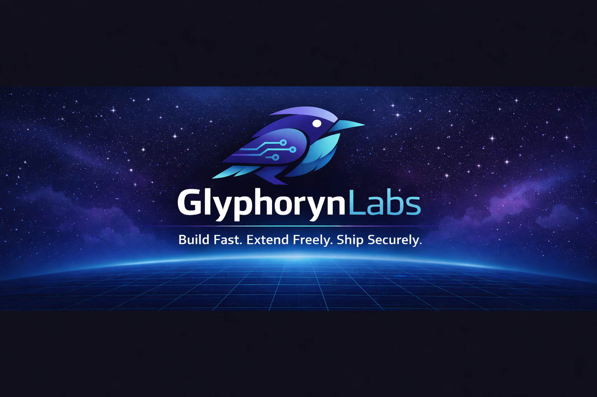

  

# GlyphorynLabs

GlyphorynLabs is an engineering collective focused on building modern developer tools, frameworks and infrastructure.

Our projects emphasize:

* modular architecture
* high performance systems
* security-first design
* privacy-aware software engineering
* extensible developer ecosystems

---

## Core Philosophy

Modern software should be:

* **Fast**
* **Composable**
* **Secure**
* **Privacy-conscious**

GlyphorynLabs develops tools that help engineers build systems aligned with these principles.

---

## Projects

### Glyphoryn

A next-generation modular developer framework designed for performance, extensibility and security-aware architecture.

---

## Principles

* Security by design
* Privacy-aware development
* Clean modular architecture
* Developer-first tooling

---

## Community

Contributions and ideas are welcome.

We believe in building open ecosystems where developers can collaborate on secure and scalable infrastructure.

---

## Motto

**Build Fast. Extend Freely. Ship Securely.**

